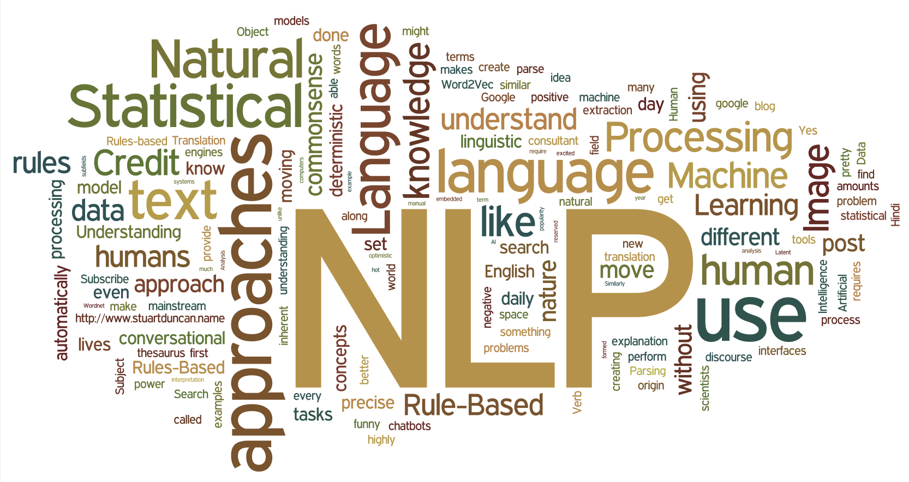
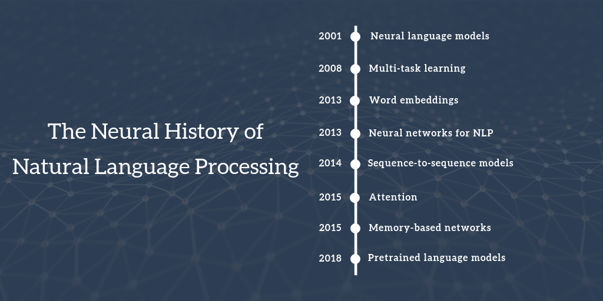

# 一文看懂 NLP 神经网络发展历史中最重要的 8 个里程碑

> 英文: <http://ruder.io/a-review-of-the-recent-history-of-nlp/index.html#nonneuralmilestones>

> 翻译: <https://www.infoq.cn/article/66vicQt*GTIFy33B4mu9>

这是两篇系列文章中的第一篇。在 2018 年的 Indaba 深度学习大会上，Herman Kamper 和我组织了一场自然语言处理研讨会，整个会议的幻灯片可以在这里下载。本文将讨论用神经网络方法解决 NLP 问题的主要进展，而第二篇文章将主要讨论 NLP 中的开放性问题。

在这篇文章中我尝试将近 15 年的自然语言处理技术发展史浓缩为 8 个高度相关的里程碑事件，为此不得不省略许多相关性较强同时也比较重要的技术事件。本文更偏向于选择与当前比较流行的神经网络技术相关的方向，这可能会给人一种错误的印象，即在这一时期没有其他有影响力的技术方法产生。需要特别强调的是，本文介绍的许多神经网络模型都建立在同时代的非神经网络技术之上。在这篇文章的最后一部分，我会着重介绍这些有影响力的非神经网络技术成果，它们为以后的 NLP 方法发展奠定了基础。

本文主要的内容如下：

- 2001 - 神经语言模型
- 2008 - 多任务学习
- 2013 - 词嵌入
- 2013 - NLP 神经网络
- 2014 - sequence-to-sequence 模型
- 2015 - 注意力机制
- 2015 - 基于记忆的网络
- 2018 - 预训练语言模型
- 其他的里程碑事件
- 传统算法里程碑事件

## 2001 - 神经语言模型

语言建模任务指的是给定前一个单词去预测文本中的下一个单词。它可能是比较简单的语言处理任务，具体的实际应用场景包括智能键盘、电子邮件回复建议（Kannan 等人， 2016）、拼写自动更正等。正如很多人所知，语言建模有着丰富的历史。其中比较经典的方法基于 n-grams ，并使用平滑处理不可见的 n-grams（Kneser & Ney, 1995）。

第一个神经语言模型是 Bengio 等人在 2001 年提出的前馈神经网络，如图 1 所示。

image

图 1：前馈神经网络语言模型（Bengio 等，2001；2003）
这个模型将从表 C 中查找到的 n 个单词作为输入向量表征。这种向量被现在的学者们称做“词嵌入”。这些词嵌入级联后被输入到一个隐藏层中，该隐藏层的输出又被输入到 softmax 层。更多关于模型的信息，请看这篇文章。

最近，在语言建模技术方面，前馈神经网络被循环神经网络（RNNs；Mikolov 等人，2010）和长短时记忆网络（LSTMs；格雷夫斯，2013）所取代。尽管近年来提出了许多扩展经典 LSTM 的新语言模型（请参阅本页以获得概述），经典的 LSTM 仍然作为一个强大的基线存在着（Melis 等人， 2018）。甚至 Bengio 等人的经典前馈神经网络在某些情况下也可以与更复杂的模型一较高下，因为这些模型通常只会考虑距离较近的单词（Daniluk 等人， 2017）。因此，如何更好地理解这种语言模型所捕获的信息也是一个比较热门的研究领域（Kuncoro 等人， 2018；布莱文斯等人，2018 年）。

语言建模通常是应用 RNN 时的第一步，对于这一点大家已经形成了共识。许多人是通过 Andrej 的博客文章第一次接触到语言建模的。语言建模是一种非监督学习形式，Yann LeCun 也将其称为预测性学习，并将其作为获得基础常识的先决条件（参见 NIPS 2016 年的幻灯片）。语言建模最引人关注的一点是，尽管它很简单，但却是本文后面讨论的许多技术发展的核心：

词嵌入：word2vec 的目标是简化语言建模。
sequence-to-sequence 模型：这种模型通过一次预测一个单词生成一个输出序列。
预训练语言模型：这些方法使用来自语言模型的表述进行迁移学习。
反过来讲，这意味着近年来 NLP 的许多重要进展都可以归结为某些形式的语言建模。为了“真正”理解自然语言，仅仅从文本的原始形式中学习是不够的。我们需要新的方法和模型。

##2008 - 多任务学习

多任务学习是在多个任务上训练的模型之间共享参数的一种通用方法。在神经网络中，可以通过给不同层施以不同的权重，来很容易地实现多任务学习。多任务学习的概念最初由 Rich Caruana 在 1993 年提出，并被应用于道路跟踪和肺炎预测（Caruana, 1998）。直观地说，多任务学习鼓励模型学习对许多任务有用的表述。这对于学习一般的、低级的表述形式、集中模型的注意力或在训练数据有限的环境中特别有用。想要更全面地了解多任务学习，请看这篇文章。

在 2008 年，Collobert 和 Weston 将多任务学习首次应用于 NLP 的神经网络。在他们的模型中，查询表（或单词嵌入矩阵）在两个接受不同任务训练的模型之间共享，如下面的图 2 所示。

image

图 2：单词嵌入矩阵的共享（Collobert & Weston, 2008 年；Collobert 等人，2011）
词嵌入的共享，使得模型能够在词嵌入矩阵中协作和共享一般的低级信息，而这些低级信息所占的参数量往往是模型中最大的一部分。2008 年，Collobert 和 Weston 共同撰写的论文对多任务学习之外的其他应用还产生了一定的影响。它率先提出了一些想法，如对文字嵌入进行预训练以及使用卷积神经网络（CNNs）来处理文本数据。它获得了 ICML 2018 年的经典论文奖（参见本文的经典论文奖演讲）。

多任务学习现在被广泛地用于 NLP 任务。充分利用现有的或“人造”的任务进行训练，可以更好的提高 NLP 效率。有关不同辅助任务的概述，请看这篇文章。虽然参数的共享通常是预定义的，但是在优化过程中也可以学习到不同的共享模式（Ruder 等人， 2017）。随着对多任务模型泛化能力的评估，多任务学习越来越重要，最近还提出了多任务学习的专用标准（Wang 等人， 2018；McCann 等人，2018 年）。

## 2013 - 词嵌入

用稀疏向量表示文本，即所谓的词袋模型在 NLP 有着悠久的历史。正如上文中介绍的，早在 2001 年就开始使用密集向量表示词或词嵌入。Mikolov 等人在 2013 年提出的创新技术是通过去除隐藏层，逼近目标，进而使这些单词嵌入的训练更加高效。虽然这些技术变更本质上很简单，但它们与高效的 word2vec 配合使用，便能使大规模的词嵌入训练成为可能。

Word2vec 有两种风格，如下面的图 3 所示：连续字袋（CBOW）和 skip-gram。不过他们的目标不同：一个是根据周围的单词预测中心单词，而另一个则相反。

image

图 3：连续字袋和 skip-gram 架构（Mikolov 等人， 2013a；2013 b）
虽然这些嵌入在概念上与使用前馈神经网络学习的嵌入在概念上没有区别，但是在一个非常大的语料库上训练之后，它们就能够捕获诸如性别、动词时态和国家 - 首都关系等单词之间的特定关系，如下图 4 所示。

image

图 4：word2vec （Mikolov 等人， 2013a；2013 b）
这些词语间关系的获得及其背后的意义引发了人们对嵌入技术的兴趣——人们开始大量研究这些线性关系形成的原理（Arora 等人， 2016；Mimno & Thompson, 2017；Antoniak & Mimno，2018 年；Wendlandt 等人，2018 年）。然而，推动词嵌入技术成为当前 NLP 的主流技术的却不是这些原理，而是在初始化时使用预训练的嵌入，因为这样做可以提高下游任务的性能。

虽然 word2vec 捕捉到的词间关系很直观、质量高得甚至有些神奇，但后来的研究表明，word2vec 本身并没有什么特别之处：词嵌入也可以通过矩阵分解来学习（Pennington 等人，2014）；通过适当的调优，SVD 和 LSA 等经典的矩阵分解方法也得到了类似的结果（Levy 等人， 2015）。

从那以后，人们开始投入大量的精力去探索词嵌入的各个方面（从原文引用的惊人数量可以看出）。通过这篇文章，我们可以看出一些趋势和未来的方向。尽管有许多发展进步，但到现在为止，word2vec 仍然是大众的首选。对 Word2vec 的使用范围已经不限于单词级别了：基于局部上下文学习嵌入的简单目标——带负抽样的 skip-gram 已被用于学习句子表示（Mikolov & Le, 2014；Kiros 等人，2015）。Word2vec 甚至还在网络（Grover & Leskovec, 2016）和生物序列（Asgari & Mofrad, 2015）等其他应用场景中发挥了作用。

一个比较有研究价值的技术方向是将不同语言的词嵌入到同一个空间中，以实现（零样本）跨语言迁移。以一种完全不受监督的方式（至少对于类似的语言来说）学习数据以实现一个好的推测效果变得越来越有可能（Conneau 等人，2018 年；Artetxe 等人，2018 年；Søgaard 等人，2018）。这种学习方式可被应用于语言资源缺乏的无监督机器翻译系统中（Lample 等人，2018;；Artetxe 等人，2018）。查看（Ruder 等人， 2018）以获得概述。

## 2013 - NLP 神经网络

2013 年和 2014 年是 NLP 问题开始引入神经网络模型的时期。使用最广泛的三种主要的神经网络是：循环神经网络、卷积神经网络和递归神经网络。

循环神经网络（RNNs） 循环神经网络是处理 NLP 中普遍存在的动态输入序列的一个最佳的技术方案。Vanilla RNNs （Elman, 1990）很快被经典的长 - 短期记忆网络（Hochreiter & Schmidhuber，1997）所取代，它被证明对消失和爆炸梯度问题更有弹性。在 2013 年之前，RNN 仍被认为很难训练；Ilya Sutskever 的博士论文为改变这种现状提供了一个关键性的例子。下面的图 5 对 LSTM 单元进行了可视化显示。双向 LSTM （Graves 等人， 2013）通常用于处理左右两边的上下文。

image

图 5：LSTM 网络（来源：Chris Olah）
卷积神经网络（CNNs） 卷积神经网络本来是广泛应用于计算机视觉领域的技术，现在也开始应用于语言（Kalchbrenner 等人， 2014；Kim 等人，2014）。文本的卷积神经网络只在两个维度上工作，其中滤波器（卷积核）只需要沿着时间维度移动。下面的图 6 显示了 NLP 中使用的典型 CNN。

image

图 6：文本卷积神经网络（Kim, 2014）
卷积神经网络的一个优点是它们比 RNN 更可并行化，因为其在每个时间步长的状态只依赖于本地上下文（通过卷积运算），而不是像 RNN 那样依赖过去所有的状态。使用膨胀卷积，可以扩大 CNN 的感受野，使网络有能力捕获更长的上下文（Kalchbrenner 等人， 2016）。CNN 和 LSTM 可以组合和叠加（Wang 等人， 2016），卷积也可以用来加速 LSTM （Bradbury 等人， 2017）。

递归神经网络 RNN 和 CNN 都将语言视为一个序列。然而，从语言学的角度来看，语言本质上是层次化的：单词被组合成高阶短语和从句，这些短语和从句本身可以根据一组生产规则递归地组合。将句子视为树而不是序列的语言学启发思想产生了递归神经网络（Socher 等人， 2013），如下图 7 所示。

image

图 7：递归神经网络（Socher 等人， 2013）
递归神经网络从下到上构建序列的表示，这一点不同于从左到右或从右到左处理句子的 RNN。在树的每个节点上，通过组合子节点的结果来计算新的结果。由于树也可以被视为在 RNN 上强加不同的处理顺序，所以 LSTM 自然地也被扩展到树上（Tai 等人， 2015）。

RNN 和 LSTM 可以扩展到使用层次结构。单词嵌入不仅可以在本地学习，还可以在语法语境中学习（Levy & Goldberg, 2014）；语言模型可以基于句法堆栈生成单词（Dyer 等人， 2016）；图卷积神经网络可以基于树结构运行（Bastings 等人， 2017）。

## 2014 - sequence-to-sequence 模型

2014 年，Sutskever 等人提出了 sequence-to-sequence 模型。这是一个使用神经网络将一个序列映射到另一个序列的通用框架。在该框架中，编码器神经网络逐符号处理一个句子，并将其压缩为一个向量表示；然后，一个解码器神经网络根据编码器状态逐符号输出预测值，并将之前预测的符号作为每一步的输入，如下图 8 所示。

image

图 8：sequence-to-sequence 模型（Sutskever 等人， 2014）
机器翻译是对这个框架比较成功的应用。2016 年，谷歌宣布将开始用神经 MT 模型取代基于单片短语的 MT 模型（Wu 等人， 2016）。根据 Jeff Dean 的说法，这意味着用 500 行神经网络模型替换 50 万行基于短语的 MT 代码。

由于其灵活性，这个框架现在是自然语言生成任务的首选框架，其中不同的模型承担了编码器和解码器的角色。重要的是，解码器模型不仅可以解码一个序列，而且可以解码任意表征。例如，可以基于图像生成标题（Vinyals 等人， 2015）（如下图 9 所示）、基于表生成文本（Lebret 等人， 2016）和基于应用程序中源代码更改描述（Loyola 等人， 2017）。

image

图 9：基于图像生成标题（Vinyals 等人，2015）
sequence-to-sequence 学习甚至可以应用于 NLP 中输出具有特定结构的结构化预测任务。为了简单起见，输出被线性化，如下面的图 10 所示，用于进行选区解析。神经网络已经证明了在有足够数量的训练数据进行选区分析（Vinyals 等人，2015）和命名实体识别（Gillick 等人， 2016）的情况下，直接学习可以产生这种线性化输出的能力。

image

图 10：线性化选区解析树（Vinyals 等人，2015）
序列和解码器的编码器通常基于 RNN，但可以使用其他模型类型。新的体系结构主要来源于 MT 的贡献，它是 sequence-to-sequence 模型体系结构的主要开发者。最新的模型有 deep LSTMs （Wu 等人，2016；tional encoders 、Kalchbrenner 等人，2016；Gehring 等人， Transformer 、Vaswani 等人，2017）和 LSTM 与 Transformer 的结合体（Chen 等人， 2018）。

## 2015 - 注意力机制

注意力机制（Bahdanau 等人， 2015）是神经网络机器翻译 （NMT）的核心创新之一，也是使 NMT 模型胜过经典的基于短语的 MT 系统的关键思想。sequence-to-sequence 模型的主要瓶颈是需要将源序列的全部内容压缩为一个固定大小的向量。注意力机制通过允许解码器回头查看源序列隐藏状态来缓解这一问题，然后将其加权平均作为额外输入提供给解码器，如下面的图 11 所示。

image

图 11：Attention（Bahdanau 等人， 2015）
注意力机制有很多不同的形式（Luong 等人，2015）。这里有一个简短的概述。注意力机制广泛适用于任何需要根据输入的特定部分做出决策的任务，并且效果不错。它已被应用于一致性解析（Vinyals 等人，2015）、阅读理解（Hermann 等人，2015）和一次性学习（Vinyals 等人，2016）等诸多领域。输入甚至不需要是一个序列，即可以包含其他表示，如图像字幕（Xu 等人， 2015），如下图 12 所示。注意力机制的一个额外的功能是，它提供了一种少见的功能，我们可以通过检查输入的哪些部分与基于注意力权重的特定输出相关来了解模型的内部工作方式。

image

图 12：图像字幕模型中的视觉注意力，预测模型在生成“飞盘”时所关注的内容。（Xu 等人， 2015）
注意力机制也不仅仅局限于观察输入序列；可以使用 self-attention 查看句子或文档中的周围单词，以获得更佳的上下文敏感的词表示。Transformer 架构的核心是多层次的自我关注（Vaswani 等人， 2017），这是目前 NMT 最先进的模型。

## 2015 - 基于记忆的网络

注意力机制可以看作是模糊记忆的一种形式。记忆由模型的隐藏状态组成，模型选择从记忆中检索内容。想要更详细地了解注意力及其与记忆的联系，请看这篇文章。研究者们提出了许多具有更明确记忆的模型。这些模型有不同的变体，如神经图灵机（Graves 等 ，2014）、记忆网络（Weston 等 ，2015）和端到端记忆网络（Sukhbaatar 等，2015）、动态记忆网络（Kumar 等 ，2015）、神经微分计算机（Graves 等，2016）和循环实体网络（Henaff 等，2017）。

记忆的访问通常基于与当前状态的相似度，类似于注意力，通常可以写入和读取。模型在如何实现和利用内存方面有所不同。例如，端到端记忆网络多次处理输入，并更新记忆以实现多个推理步骤。神经图灵机也有一个基于位置的寻址，这允许他们学习简单的计算机程序，如排序。基于记忆的模型通常应用于一些特定任务中，如语言建模和阅读理解。在这些任务中，长时间保存信息应该很有用。记忆的概念是非常通用的：知识库或表可以充当记忆，而记忆也可以根据整个输入或它的特定部分填充。

## 2018 - 预训练语言模型

预训练的词嵌入与上下文无关，仅用于初始化模型中的第一层。最近几个月，一系列监督型任务被用于神经网络的预训练（Conneau 等人，2017；McCann 等人，2017；Subramanian 等人，2018 年）。相反，语言模型只需要无标签的文本；因此，训练可以扩展到数十亿个令牌、新域和新语言。预训练语言模型于 2015 年被首次提出（Dai & Le, 2015）；直到最近，它们才被证明在各种任务中效果还是不错的。语言模型嵌入可以作为目标模型中的特征（Peters 等人，2018 年），或者使用语言模型对目标任务数据进行微调（Ramachandran 等人，2017 年；霍华德 & 鲁德出版社，2018 年）。添加语言模型嵌入可以在许多不同的任务中提供比最先进的技术更大的改进，如下面的图 13 所示。

image

图 13：嵌入到最先进的语言模型中的改进（Peters 等人，2018）
预训练的语言模型已经被证明可以用更少的数据进行学习。由于语言模型只需要无标记的数据，因此对于标记数据稀缺的低资源语言尤其有用。有关预训练语言模型潜力的更多信息，请参阅本文。

## 其他里程碑事件

其他一些技术发展没有上面提到的那样流行，但仍然有广泛的影响。

### 基于字符的表示

在字符上使用 CNN 或 LSTM 以获得基于字符的词表示的做法现在相当普遍，特别是对于形态信息重要或有许多未知单词的丰富的语言和任务，效果更加明显。据我所知，序列标签使用基于字符的表示（Lample 等人，2016；普兰克等人，2016），可以减轻在计算成本增加的情况下必须处理固定词汇表的需要，并支持完全基于字符的 NMT （Ling 等人， 2016；Lee 等人，2017）。

### 对抗学习

对抗学习方法已经在 ML 领域掀起了风暴，在 NLP 中也有不同形式的应用。对抗性的例子越来越被广泛使用，它不仅是作为一种工具来探究模型和理解它们的失败案例，而且也使自身更加鲁棒（Jia & Liang， 2017）。（虚拟）对抗性训练，即最坏情况扰动（Miyato 等人，2017）和领域对抗性损失（Ganin 等人， 2016；Kim 等人，2017），同样可以使模型更加鲁棒。生成对抗网络（GANs）对于自然语言生成还不是很有效（Semeniuta 等人， 2018），但在匹配分布时很有用（Conneau 等人， 2018）。

### 强化学习

强化学习已被证明对具有时间依赖性的任务有效，例如在训练期间选择数据（Fang 等人， 2017；Wu 等人， 2018）和建模对话（Liu 等人， 2018）。RL 对于直接优化不可微的末端度量（如 ROUGE 或 BLEU）也有效，反而在汇总中优化替代损失（如交叉熵）（Paulus 等人， 2018；Celikyilmaz 等人，2018）和机器翻译场景效果就不明显了（Ranzato 等人，2016）。类似地，逆向强化学习在过于复杂而无法指定数据的情况下也很有用，比看图说话任务（Wang 等人， 2018）。

## 非神经网络算法的里程碑事件

在 1998 年和接下来的几年里，FrameNet 项目诞生了（Baker 等人， 1998），这指导了语义角色标注的任务。这是一种浅语义解析的形式，至今仍在积极研究开发中。在本世纪初，与自然语言学习会议（CoNLL）一起组织的共享任务促进了核心 NLP 任务的研究，如组块（Tjong Kim Sang 等人， 2000）、命名实体识别（Tjong Kim Sang 等人， 2003）和依赖解析（Buchholz 等人， 2006）等。许多 CoNLL 共享任务数据集现在仍然被用作评估的标准。

### 2001 年，条件随机场

（CRF；Lafferty 等人， 2001）成为了最具影响力的序列标注方法类别之一，获得了 ICML 2011 的最佳论文奖。CRF 层是当前最先进的序列标注问题模型的核心部分，这些模型具有标签间的相互依赖性，如命名实体识别（Lample 等，2016）。

### 2002 年，双语互译质量评估辅助工具

（BLEU；Papineni 等人，2002）给出了双语互译质量度量标准，这使得 MT 系统得以扩展。其现在仍然是 MT 评估的标准度量标准。同年，结构感知机（Collins，2002）问世，为结构化感知工作奠定了基础。在同一次会议上，情感分析也成了最受欢迎和广泛研究的 NLP 任务之一（Pang 等人， 2002）。这三篇论文都获得了 2018 年 NAACL 最佳论文奖。

### 2003 年引入了潜在狄利克雷分配

（LDA；Blei 等人，2003），这是机器学习中应用最广泛的技术之一，至今仍是主题建模的标准方法。在 2004 年，有学者提出了比 SVM 更适合于捕获结构化数据中的相关性的新最大边缘模型（Taskar 等人， 2004a；2004b）。

### 2006 年，OntoNotes

（Hovy 等人， 2006）介绍了一个具有多个注释和高注释协议的大型多语言语料库。OntoNotes 已被用于训练和评估各种任务，如依赖解析和引用解析。Milne 和 Witten（2008）在 2008 年介绍了利用维基百科丰富机器学习方法的方案。到目前为止，Wikipedia 是训练 ML 方法最有用的资源之一，无论是用于实体链接和消除歧义、语言建模、知识库还是其他各种任务。

### 2009 年，提出了远程监督的概念

（Mintz 等人， 2009）。远程监督利用启发式或现有知识库中的信息生成带有噪声的模式，可用于从大型语料库中自动提取示例。远程监督现已被广泛应用，并且已经是关系提取、信息提取、情感分析等领域的常用技术。
