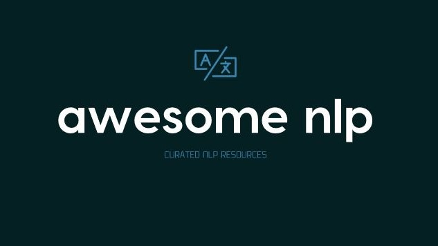

# awesome-nlp

> 专门用于自然语言处理的精选资源列表

**Maintainers** - [Keon](https://github.com/keon), [Martin](https://github.com/outpark), [Nirant](https://github.com/NirantK), [Dhruv](https://github.com/the-ethan-hunt)

## 内容

- [Research Summaries and Trends](#research-summaries-and-trends)
- [Tutorials](#tutorials)

      - [Reading Content](#reading-content)
      - [Videos and Courses](#videos-and-online-courses)
      - [Books](#books)

- [Libraries](#libraries)

      - [Node.js](#user-content-node-js)
      - [Python](#user-content-python)
      - [C++](#user-content-c++)
      - [Java](#user-content-java)
      - [Kotlin](#user-content-kotlin)
      - [Scala](#user-content-scala)
      - [R](#user-content-R)
      - [Clojure](#user-content-clojure)
      - [Ruby](#user-content-ruby)
      - [Rust](#user-content-rust)
      - [Services](#services)
      - [Annotation Tools](#annotation-tools)

- [Datasets](#datasets)
- [NLP in Korean](#nlp-in-korean)
- [NLP in Arabic](#nlp-in-arabic)
- [NLP in Chinese](#nlp-in-chinese)
- [NLP in German](#nlp-in-german)
- [NLP in Spanish](#nlp-in-spanish)
- [NLP in Indic Languages](#nlp-in-indic-languages)
- [NLP in Thai](#nlp-in-thai)
- [NLP in Vietnamese](#nlp-in-vietnamese)
- [NLP in Danish](#nlp-in-danish)
- [NLP in Indonesian](#nlp-in-indonesian)
- [Other Languages](#other-languages)
- [Credits](#credits)

## 研究摘要和趋势

- [NLP-概观](https://nlpoverview.com/) 是应用于 NLP 的深度学习技术的最新概述，包括理论，实现，应用和最先进的结果。 对于研究人员来说，这是一个伟大的 Deep NLP 简介。
- [NLP-进展](https://nlpprogress.com/) 跟踪自然语言处理的进展, 包括数据集和最常见的 NLP 任务的当前最新技术
- [NLP 的 ImageNet 时刻已经到来](https://thegradient.pub/nlp-imagenet/)
- [ACL 2018 亮点: 在更具挑战性的设置中理解表示和评估](http://ruder.io/acl-2018-highlights/)
- [ACL 2017 的四个深度学习趋势。第一部分: 语言结构和词嵌入](https://www.abigailsee.com/2017/08/30/four-deep-learning-trends-from-acl-2017-part-1.html)
- [ACL 2017 的四个深度学习趋势。第二部分: 可解释性和注意力](https://www.abigailsee.com/2017/08/30/four-deep-learning-trends-from-acl-2017-part-2.html)
- [EMNLP 2017 的亮点: 令人兴奋的数据集，群集的返回等等！](http://blog.aylien.com/highlights-emnlp-2017-exciting-datasets-return-clusters/)
- [自然语言处理的深度学习 (NLP): 进步与趋势](https://tryolabs.com/blog/2017/12/12/deep-learning-for-nlp-advancements-and-trends-in-2017/?utm_campaign=Revue%20newsletter&utm_medium=Newsletter&utm_source=The%20Wild%20Week%20in%20AI)
- [自然语言生成的现状调查](https://arxiv.org/abs/1703.09902)
